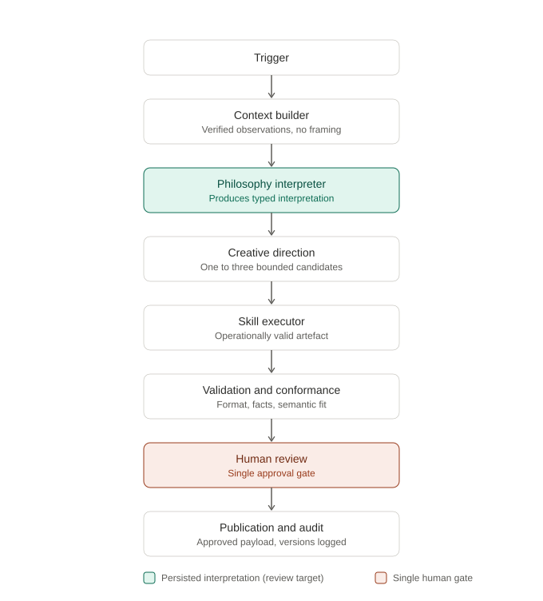
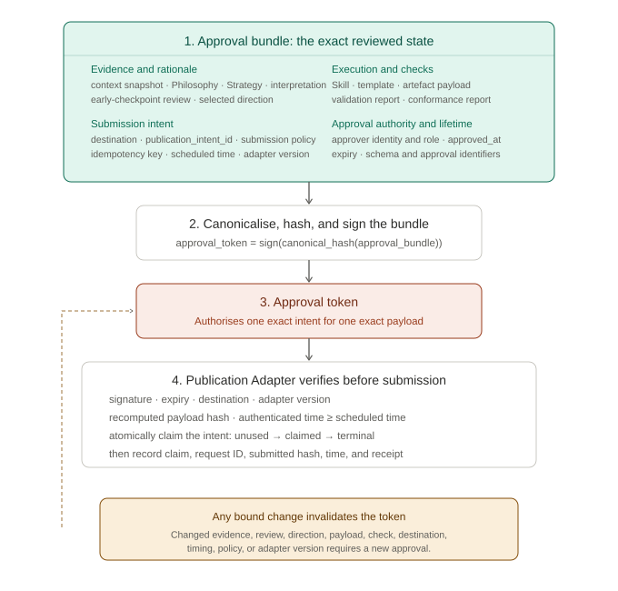
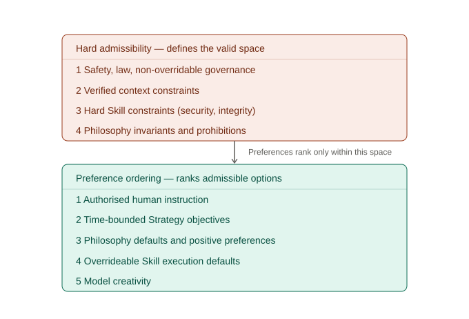

> Copyright © 2026 Daniel Schutterop
> Licensed under the [Creative Commons Attribution 4.0 International License](https://creativecommons.org/licenses/by/4.0/).

# The Philosophy Layer: An Accountable and Traceable Architecture for Organisational AI Judgement

Daniel Schutterop

# Abstract

A common AI application pattern combines **context** (the facts available to the system), a **skill** (structured instructions defining what the system may do) and **guardrails** (checks that enforce declared constraints).

Facts establish the evidential basis. Skills and guardrails constrain the admissible action space and may encode selection rules. What these mechanisms do not by themselves require is a separate, organisation-scoped record of why one admissible action is appropriate in this situation.

This paper proposes the **Philosophy layer**: a structured, versioned representation of organisational intent, audience, character and decision principles, executed as an explicit interpretation step between verified context and constraint-governed execution.

The Philosophy layer does not make a language model better at interpretation than at generation. The interpreter is the same class of model and remains subject to the same failure modes. Nor does the layer require any model capability a sufficiently elaborate prompt could not express. The contribution is therefore a *discipline*, not a capability: it takes interpretation — normally dissolved into the generation step — and requires it to exist as a typed, versioned, independently reviewable and rejectable record, checked against the artefact it justifies, before any downstream artefact exists. What this buys is that judgement becomes inspectable, testable, versionable and rejectable as a reviewable pipeline stage rather than an invisible property of the output. The value is architectural, not magical.

This is an architectural position paper. Its contribution is a decision-record architecture: a typed interpretation artefact, a governed lifecycle for organisational principles and an approval chain that links context, interpretation, artefact and publication state. It defines the mechanism, its boundaries and a path to empirical evaluation rather than claiming validated performance gains. The architecture supports conditions for accountable review; it does not by itself establish legal responsibility, organisational legitimacy or effective redress.

---

# 1. The Problem

The idea emerged from a small automation problem: generating an Instagram Story for Il Tiratore, my son's ice cream cart, in response to a real-world trigger: the cart opens, the weather improves or a product becomes available.

The obvious architecture:

```text
Trigger → Context → Content generation → Validation → Human approval → Publication
```

The skill contains the obvious constraints: verified products and prices only, no invented opening hours, correct dimensions, mandatory notices, maximum one emoji and no publication without approval.

Given this factual context:

```json
{
 "event": "cart_opened",
 "local_datetime": "2026-07-19T14:00:00+02:00",
 "day_of_week": "Sunday",
 "weather": "sunny",
 "temperature_c": 25,
 "available_products": ["Aperol Spritz Sorbet", "Limoncello Spritz Sorbet"],
 "price": "€5",
 "contains_alcohol": true,
 "evidence_refs": [
   "operations:cart_state:20260719T140000+0200",
   "weather:observation:20260719T140000+0200",
   "inventory:snapshot:20260719T135500+0200",
   "product_catalog:alcohol_classification:20260719T135500+0200"
 ]
}
```

`contains_alcohol` is a deterministically derived product attribute, supported here by the product catalogue rather than inferred by the Philosophy Interpreter. The distinction is between derived facts with traceable evidence and normative inferences about what those facts mean.

A fully compliant result might be:

> Sunny today.
> Come and enjoy a refreshing sorbet.
> Aperol Spritz and Limoncello Spritz · €5
> Contains alcohol · 18+

Factually correct. Rule-compliant. Interchangeable with content from almost any hospitality business on earth.

The structural gap has two parts, and the second rests on the first. Skills and guardrails may contain selection rules, but the common pattern does not require the resulting judgement to exist as an independent decision record:

```text
Facts answer:              What is true?
Skills/guardrails answer: What is allowed and technically valid?
Not necessarily recorded: What, in this situation, actually matters?   (relevance)
Not necessarily recorded: What is therefore appropriate to say, if anything?
```

Relevance is necessary but not sufficient: an output can fasten onto the single most relevant fact and still be inappropriate, and sometimes the appropriate move is to say nothing at all. Without that judgement, generative systems fall back on category patterns. Warm weather produces sunshine language. Availability produces urgency. A social post produces a call to action. Statistically plausible, contextually empty.

The timestamp establishes that it is Sunday afternoon, while sunny weather and 25°C are verified observations. The conclusion that people are likely to be outside, engaged in leisure and receptive to a spontaneous small pleasure is not another fact. It is an interpretation of what those facts mean in this setting. The relevant interpretation of this warm Sunday is therefore not "it is sunny, so mention the sun." It is: *people are already likely to be outside and the product can become a natural part of an afternoon already in progress.* That is the relevance judgement; the appropriate output follows from it rather than from the weather, and leads to a different class of output:

> One more good thing for the afternoon.

The specific wording is unimportant. What matters is that an interpretation was **selected before generation began** and that the boundary between verified observation and organisational inference remains visible.

## 1.1 Operational Meaning of Accountability

This paper uses *accountability* in a bounded operational sense. An accountable decision chain must make it possible to reconstruct the relevant technical and human actions, identify the actors and versions involved, inspect and contest the recorded interpretation and require renewed authorisation after a material change. Traceability and provenance support those conditions, but they do not by themselves establish legitimate authority, legal liability, an effective forum for answerability or meaningful consequences and redress [9, 10]. The architecture proposed here is therefore an accountability-enabling mechanism rather than a complete theory or guarantee of accountability.

## 1.2 Contributions

None of these contributions rests on a new model capability. Each applies established software-governance practice — typed records, versioning, approval chains and provenance in the manner of W3C PROV — to the interpretation step of an LLM pipeline, a step that is normally left implicit. The claim is that imposing this discipline on interpretation specifically is useful, not that the discipline is itself novel.

This position paper makes three architectural contributions:

1. A **typed interpretation artefact** that records how verified context was judged to be organisationally relevant, including applicable principles, rejected frames and a recommendation to act, abstain, defer or escalate.
2. A **governed decision chain** that versions organisational principles, separates them from event context and execution constraints and supports investigation and attribution to a specific layer and version.
3. An **integration model** that carries the reviewed interpretation through semantic conformance, exact-state approval and submission, alongside an empirical agenda for evaluating reviewability, error localisation and conformance. The approval machinery preserves the integrity of the interpreted decision chain; it is supporting infrastructure rather than the paper's primary novelty.

---

# 2. The Philosophy Layer

**The Philosophy layer is a versioned decision layer that transforms verified context into an explicit interpretation of relevance, intent and appropriate action before execution begins.**[^philosophy-name]

[^philosophy-name]: The term *Philosophy* is used here in the organisational sense of a stable normative account of purpose, identity and decision principles. It is not a claim to philosophical theory and is not synonymous with a model constitution.

It contains the stable organisational knowledge needed to decide what factual context *means* before an artefact is generated:

* why the organisation exists;
* who it serves, described as **people in situations**, not demographic segments;
* its character, defined positively and negatively, including what it refuses to be: sentimental, desperate for attention or dependent on clichés;
* which opportunities are worth communicating;
* when silence is preferable to output.

The Philosophy is normative rather than merely descriptive. It represents how the organisation intends to judge situations, not simply how it has behaved in the past.

It is not a tone-of-voice guide. Tone determines how something sounds. The Philosophy layer helps determine whether something is worth saying at all and which part of the situation carries the meaning.

Its first output is not a caption or a creative concept. It is a machine-readable interpretation that keeps evidence and inference separate:

```json
{
 "verified_observations": {
   "local_datetime": "2026-07-19T14:00:00+02:00",
   "day_of_week": "Sunday",
   "weather_condition": "sunny",
   "temperature_c": 25,
   "cart_state": "open"
 },
 "context_evidence": [
   "operations:cart_state:20260719T140000+0200",
   "weather:observation:20260719T140000+0200",
   "inventory:snapshot:20260719T135500+0200"
 ],
 "interpretive_inference": "These conditions are likely to place more people outdoors in an unhurried leisure context.",
 "principles_applied": [
   "audience.already_in_a_good_moment",
   "character.calm",
   "communication.no_forced_urgency"
 ],
 "organisational_relevance": "The product fits naturally into a leisure moment already underway.",
 "recommendation": "develop_direction",
 "decision_class": "audience_moment_extension",
 "semantic_direction": "Treat the product as a natural addition to an afternoon already underway.",
 "positive_fit_condition": "The artefact must read as addressed to an afternoon already in progress, must not announce, summon or persuade, and must not name the weather as the reason.",
 "rejected_frames": ["heat_relief", "urgency"],
 "avoid": ["generic summer language", "discount messaging", "forced category clichés"],
 "missing_evidence": [],
 "unresolved_questions": []
}
```

The controlled recommendation vocabulary should include at least:

```text
develop_direction
do_not_publish
request_more_context
defer
escalate
```

This prevents the interpreter from manufacturing certainty when context is incomplete or when the decision falls outside its delegated authority. `missing_evidence` and `unresolved_questions` are preferable to a superficially precise confidence score because they identify what would have to change before the pipeline can continue.

These fields have explicit lifecycle semantics. `develop_direction` is valid only when no item remains marked as blocking. A non-blocking uncertainty may remain visible, but it must be labelled as such and may not support a factual claim or determine admissibility. `request_more_context` identifies evidence that must be supplied before interpretation resumes. `defer` identifies a condition or time at which the decision should be reconsidered. `escalate` identifies the authority or normative question outside the interpreter's delegation. `do_not_publish` requires sufficient evidence to justify silence; lack of evidence alone is not evidence that silence is appropriate. Items are typed rather than free-form strings, for example:

```json
{
 "missing_evidence": [
   {
     "item": "Current product availability has not been verified.",
     "status": "blocking",
     "required_source": "inventory_snapshot"
   }
 ],
 "unresolved_questions": [
   {
     "question": "Does this communication fall within delegated authority?",
     "status": "blocking",
     "resolution_route": "publisher_review"
   }
 ]
}
```

Unlike `recommendation`, whose baseline set the architecture fixes above, `decision_class` is defined per deployment: each organisation enumerates the situation types it treats as distinct (here, `audience_moment_extension`). That enumeration is itself a governed, normative choice, not a fixed part of the architecture (§5.4). Because the taxonomy is authored rather than given, its own most likely failure is *under-enumeration*. When no class fits without semantic distortion, the interpreter must return `decision_class: "unclassified"` with `recommendation: "escalate"`. It may not silently force the situation into the nearest existing class. Repeated unclassified outcomes then become evidence for taxonomy review rather than invisible classification error (§5.6, §9).

Before Creative Direction begins, the interpretation passes through an **early rejection checkpoint**. A human reviewer, deterministic policy or delegated model guardrail may reject it, request revision or permit the pipeline to continue. Continuation is not publication approval: the checkpoint exists to stop a faulty premise before downstream generation consumes time, tokens or review effort. Creative Direction can then explore one or more concrete expressions within the accepted semantic boundaries. The Skill Executor converts the selected direction into an operationally valid artefact.

Some practical reasoning principles that belong in this layer:

* **The event is not always the story.** A trigger reports change; it does not decide which aspect of the change matters.
* **Human behaviour matters more than raw conditions.** Weather, time and availability are usually relevant because of what they make people *do*.
* **A specific observation beats generic enthusiasm.** "People are likely to be outside" is more useful than "What a beautiful day", provided the statement is retained as an inference rather than relabelled as fact.
* **Silence is a valid result.**

## 2.1 A Philosophy in Practice: The Il Tiratore Excerpt

Abstract descriptions of the layer invite a fair objection: perhaps writing a good Philosophy is no easier than writing a good prompt, in which case the judgement burden has merely been relocated onto a document author. The honest answer is that the burden *is* relocated (that is the design), but it lands in a short, stable and reviewable document rather than in a per-request prompt or in the head of whoever last edited the system. The excerpt below is the core of the actual Il Tiratore Philosophy, lightly edited for publication:

> **How we began.** The initiative began in 2021 as a first job for my son: a safe setting in which to learn how a business works while making people happy with proper ice cream. It escalated when I took up ice-cream making as a very over-engineered hobby. Today the cart sells only what is made in the home workshop. The operating rule is simple: zero room for error in production and 100% room for fun at the cart.
>
> **Who we serve.** Cyclists, walkers and people in small boats passing through a small village and pausing at the canal. We serve people who are already in the middle of a good moment outdoors. We do not summon people to one. A scoop is a small pleasure added to an afternoon by the water in the sun. We facilitate that because we know how good it is to sit here.
>
> **Who we are not.** The loud gelateria with a singing showman behind the scoop.
>
> **On the name.** *Il Tiratore* literally means "the marksman". Internally it is a wink at aiming true: exactness. Externally we tell exactly one story: precision. No weapons. No explanation.
>
> **Character: what we are.** An artisan workshop. Laboratory precision. High-grade ingredients and materials. Calm, space and trust.
>
> **Character: what we refuse to be.** Childish or shouty Italian cliché. Vintage-retro styling. Stock-photo cheerfulness.

Three properties of this document do the operational work.

First, the audience is described as **people in situations**, not demographics. "People already in the middle of a good moment" is an interpretive instruction: it tells the interpreter to look for what the audience is *doing*. It also forbids rescue framings. The audience is not suffering, waiting or in need of persuasion.

Second, the **anti-patterns are operationalisable as review and test criteria**. Return to the compliant-but-empty caption "Beat the heat with our ice-cold treats." It violates no skill constraint, yet this Philosophy rejects it on three independent grounds: heat-relief urgency contradicts *calm*; the phrasing is textbook stock-photo cheerfulness; it frames the audience as overheated people needing relief rather than people whose afternoon is already good. Meanwhile "One more good thing for the afternoon" survives every clause. A one-page document performs a semantic filtering task that no purely structural validator can.

Third, the document can hold **asymmetric knowledge**. The internal meaning of the name is available to the interpreter as identity context, while the external rule ("one story: precision, no explanation") prevents it from surfacing in output. Internal language may also be warmer than published copy. "A small pleasure" can guide interpretation without requiring sentimental language in the artefact. A monolithic prompt can express these distinctions, but it does not by itself require their isolation, testing, versioning or treatment as an independent decision record.

The excerpt is deliberately small. A Philosophy that needs fifty pages has usually absorbed context, Strategy or tone-of-voice material that belongs elsewhere (§9).

## 2.2 A Contrasting Vignette: Corporate Communication

The Il Tiratore case shows a Philosophy selecting relevance. A second case shows it doing something the first only implies: deciding whom the organisation is speaking to, and therefore which language is admissible, before a single word is chosen.

Consider a corporate communications team that must send a message about a change to employee benefits. The tone is fixed in the prompt; the facts are supplied by HR; the Skill guarantees factual correctness, mandatory disclosures and the publication process. None of these layers decides the one thing that matters most here: an employee is not a customer, and not a prospect. The organisation's Philosophy draws exactly that line. It holds that internal and external audiences stand in different relations to the organisation, and that the language itself, not merely the tone, must differ accordingly.

This has teeth precisely where a format validator is blind. The facts and the tone can both be entirely acceptable and the message can still be wrong. "We're excited to announce an enhanced benefits package" breaks no Skill constraint and reads pleasantly, yet it treats an entitlement as a marketing proposition: corporate generosity to be celebrated rather than a change with practical consequences for someone's life. The Philosophy rejects that frame before it is written:

```json
{
 "audience_relation": "employee",
 "organisational_relevance": "This affects employees' practical choices and entitlements, not customer demand.",
 "decision_class": "internal_entitlement_change",
 "language_mode": "direct, rights-aware, operationally clear",
 "semantic_direction": "State the change and its practical consequences plainly, as an entitlement update rather than a promotion.",
 "rejected_frames": [
   "benefit as corporate generosity",
   "employer-brand marketing",
   "customer-style promotional language"
 ],
 "recommendation": "develop_direction"
}
```

The distinction the vignette isolates is this: tone governs how an organisation sounds; Philosophy governs whom it believes it is speaking to, and therefore which language is appropriate even when the facts and tone remain unchanged. And because that judgement is now an explicit, persisted record, it is reviewable in the accountable sense of §1.1: a reviewer can reject the claim that an internal HR message may address employees as consumers before anything is sent, rather than discovering the misframing in a published artefact.

---

# 3. What This Solves and What It Does Not

The Philosophy Interpreter is itself a language model. A model that writes clichéd captions can write clichéd interpretations with equal fluency. Separating interpretation from generation does not, by itself, make the interpretation better. **The judgement problem is not solved; it is moved one layer up, into the open.**

That relocation is the contribution. It buys four concrete things:

**Inspectability.** A reviewer can reject an interpretation at the early checkpoint before any design, rendering or copywriting effort is spent. "The system thinks this event is about heat relief" is visible and refutable; the same assumption buried inside a finished Story is not. Permitting the pipeline to continue records that the premise was not rejected, but does not authorise publication.

**Error localisation.** A weak output may stem from incorrect facts, weak interpretation, poor execution, an unsuitable template or failed validation. Without separation, all of these collapse into "the AI generated something bad." With separation, the architecture narrows and records the candidate sources of failure so that feedback can be directed at the relevant layer — with one structural exception it does not escape: when the interpretation is itself an unfaithful account of the interpreter's operative reasoning, the fault is attributed to whichever layer's artefact *looks* wrong rather than the one whose computation *was* wrong. Localisation is therefore reliable to the granularity of the recorded artefacts, not to the granularity of the model's actual cognition. §7.2 treats this limit directly; it bounds the claim rather than voiding it, because the more common faults — invalid context, misaligned direction, execution drift, validator gaps — remain locatable.

**Constraint at the semantic level.** Traditional guardrails exclude invalid or prohibited behaviour; the Philosophy layer adds an organisation-specific semantic record that can also rule out output which is valid in form but weak in meaning. The heat-relief framing of §2.1 is one example: it violates no format rule and is still ruled out before it is written.

**Versionable intent.** Organisational judgement becomes an artefact under version control, testable in isolation, rather than folklore distributed across prompts.

The system's outputs are not guaranteed to be good, but the architecture makes them more amenable to accountable review, investigation and correction *within the limits just stated*: a traceable system can be improved deliberately rather than through undirected prompt-tinkering, provided the recorded interpretation is load-bearing rather than a fluent reconstruction.

## 3.1 Why the Interpretation Is the More Reviewable Object

The four properties above share a single root cause: in each case the reviewer inspects, rejects or tests the *interpretation* rather than the finished artefact. This is not a hopeful claim about model quality; it is a property of the representations. An interpretation is smaller, structured and semantically narrower than the caption, image or message it justifies. A reviewer can read "the system thinks this event is about heat relief" and reject it in seconds, before any design, rendering or copywriting effort exists. The equivalent judgement embedded in a polished Story must first be reverse-engineered out of the finished piece, if it is recoverable at all. The same asymmetry holds for automated testing: a schema-constrained interpretation with an enumerated `avoid` list and a `decision_class` can be scored against explicit required and prohibited criteria (§7), whereas the open question "is this artefact good?" resists that decomposition. Moving the review target from the artefact to the interpretation does not make the model wiser; it relocates judgement onto an object a human or a test harness can actually get a grip on.

Reviewability is not a virtue on its own. The interpretation is load-bearing only if it is procedurally passed to downstream stages, those stages are checked against it and the record is not merely a fluent reconstruction after the fact. The architecture specifies the first two conditions: Creative Direction and the executor receive the interpretation as a forward specification, and Semantic Conformance checks the resulting artefact (§5.2). It cannot establish the third, that the record faithfully captures the interpreter's operative reasoning. That is the rationale-laundering threat in §7.2. The defensible claim is therefore narrower: the interpretation is a more reviewable *governing* object, while its explanatory value remains an empirical question.

That the representational asymmetry is real does not establish that routing an interpretation through the early checkpoint yields better outcomes, such as earlier rejection, lower downstream cost, better fault localisation, fewer weak publications or higher reviewer agreement. A more tractable review object need not produce more correct review. That consequential claim is empirical, and it is exactly what the evaluation agenda in §7 is designed to test rather than assume.

This argument is deliberately independent of what inference costs. The economics of an extra model call are fluid: today's expensive call is next year's rounding error, and occasionally the reverse. An architecture justified primarily by cost therefore rests on a moving number. The representational asymmetry does not move: it is a structural property of *where the judgement lives*, exposed as a discrete, versioned artefact rather than dissolved into the generation step, and it holds whether the call is cheap or expensive. Cost has not disappeared; it has changed role, determining *where* the architecture is worth paying for rather than *whether* it is worth building. The next section treats that boundary directly.

## 3.2 Cost Boundary and Deployment Assumptions

An explicit interpretation stage adds a model call per trigger, a reviewable artefact per event and a governed document with an owner and an approval path. The architecture therefore introduces real cost in inference, latency, review effort and operational complexity. This paper does not attempt to prove that the trade is favourable in every domain.

In the reference domain, there are only a handful of triggers per day. Marginal inference cost is small compared with the reputational cost of publishing generic or incorrect material under the organisation's name. The early rejection checkpoint can also terminate a weak premise before direction and artefact generation, shortening correction loops and avoiding downstream inference and review cost. In that low-frequency and reputation-sensitive setting, cost is unlikely to dominate the deployment decision.

That calculus is a property of the domain, not of the architecture. The generalisations in §8, including customer support, incident communication and scheduling, can operate at orders of magnitude more triggers. Added latency, an extra call per event and human review load must then be priced against the accountability benefit. Whether the trade remains favourable in high-frequency settings is part of the evaluation agenda, not an assumed result.

---

# 4. Related Work

The idea has neighbours. It is worth being precise about where it sits — and, given that this contribution is a discipline rather than a capability, precise about which neighbours it competes with and which it merely inherits from.

**Constitutional AI** uses an explicit set of principles to steer model behaviour through critique and revision [1]. The Philosophy layer borrows the core move of externalising principles rather than leaving behaviour wholly implicit. It applies that move to *organisational* rather than *ethical* judgement and at the level of an application pipeline rather than model training.

**Deliberative Alignment** trains models to recall and reason over explicit safety specifications before answering [5]. This is the closest neighbour among the alignment methods, because both separate specification-aware interpretation from final response production. The distinction is one of scope and mechanism: Deliberative Alignment is a training method for model-level safety behaviour, whereas the Philosophy layer is an application-time architecture for organisation-specific judgement, with a persisted decision artefact, independent versioning, human approval and downstream conformance checking.

**Reasoning-step and self-improvement methods.** Chain-of-thought elicits intermediate reasoning to change task performance [2]; self-refinement loops such as Reflexion [15] and Self-Refine [16] have the model critique and revise its own output. All keep the judgement inside the generation process and optimise the same artefact using self-generated feedback; the Philosophy layer instead externalises a typed, persisted interpretation as the object of independent human review and versioning, not a self-improvement signal, and exposes a rejectable rationale before generation rather than after. The persisted interpretation is likewise not presented as a faithful transcript of private model cognition (§7.2); it is an operational rationale that can be reviewed, tested and rejected.

**Behavioural specifications and policy authoring.** Model constitutions and specs — OpenAI's Model Spec with its instruction hierarchy [6], Anthropic's 2026 Claude Constitution [7] — and LLM-as-judge evaluation [3] resemble a Philosophy in normative content but govern a general-purpose model or score outputs after generation. Policy Maps and the Policy Projector tool [8] expose behavioural regions as a governed object, as the Philosophy layer does, but for interactive authoring rather than runtime interpretation of verified context. The Philosophy layer is narrower on all three counts: one organisation's intent, applied to verified context, before generation. Known LLM-judge biases — sensitivity to fluency, position and self-enhancement — remain relevant wherever the same principle document later serves as a rubric (§5.2, §7).

**Policy/mechanism separation** is a longstanding systems-design principle: mechanism provides capability while policy determines how it is used [4]. The Philosophy layer follows the same instinct at a narrower distinction — a policy or Skill determines which actions are permitted and executable; a Philosophy helps select which permitted action is appropriate in a particular situation.

**Provenance, reviewability and audit.** A cluster of work supplies the accountability foundations this paper builds on rather than competes with: decision provenance [9] and traceability [10] (the basis for the bounded definition in §1.1); reviewable automated decision-making [17] and internal algorithmic auditing [18] at process and lifecycle granularity; evidence tracing and execution provenance for LLM agents [19], which names semantic provenance as an open challenge; compliance-by-construction argument graphs [20], whose typed, evidence-linked claims could host an interpretation as a claim-bearing node; and LLM audit trails [11]. Against each, the Philosophy layer's narrower contribution is the same: an event-level, organisation-scoped normative interpretation record, produced before generation, with a downstream semantic-conformance relationship and exact-state approval binding. It is a particular typed entity within such a provenance graph, not a replacement for it — and could be represented as a domain-specific profile of W3C PROV-DM [12] (entities: context snapshots, Philosophy versions, interpretations, directions, artefacts, approval manifests; activities: model calls, reviews, publication attempts; agents: humans, organisations, software components). The paper does not define that mapping formally, but the standard is an appropriate interoperability target.

**Runtime enforcement and authority.** Runtime guardrails such as NeMo Guardrails [13] can constrain topic, dialogue path, style, tool use and output at several stages — so they are not merely syntactic validators — and runtime governance evaluates policies over the execution path, identity, proposed action and organisational state [24]. Structured-output and constrained-decoding systems [14] guarantee schema conformance but not semantic appropriateness, a distinction JSONSchemaBench makes concrete by scoring structure and quality separately. Authenticated delegation [26] scopes whose authority an agent may exercise, and commit-time authorisation [27] checks that authority evidence is fresh, causally prior and effect-bound at a durable effect — overlapping directly with the approval and adapter semantics of §5.2. None of these requires a persisted, pre-generation record of *why the available context was judged organisationally relevant*; a Philosophy interpretation is one governed input to these mechanisms, not an alternative to them. Auditable-agent frameworks [25] supply the broader dimensions — action recoverability, lifecycle coverage, policy checkability, responsibility attribution, evidence integrity — into which the interpretation record fits as one normative entity without, by itself, making an agent system fully auditable.

**Brand guidelines and system prompts** remain the obvious incumbent, and the most natural objection to this paper is that a Philosophy layer is "a system prompt with extra steps." Functionally, the Philosophy can be represented as prompt content; there is no exotic model capability hiding underneath it. A carefully engineered prompt system can also version components and emit intermediate outputs. The contribution claimed here is narrower: a required, typed and governed interpretation artefact with an explicit lifecycle and downstream conformance relationship. Treating that artefact as a first-class decision record separates stable principles from event context and execution rules, permits review of the decision before publication is authorised and supports investigation of later failures by layer and version. This is the discipline-not-capability claim in concrete form: nothing new the model can *do*, but a governed constraint on *where its judgement must live and what must be recorded about it*.

The comparison can be summarised by the primary object each approach governs:

| Approach | Primary governed object | Mandatory pre-generation normative interpretation | Persisted decision record | Runtime enforcement or authority binding |
|---|---|---:|---:|---:|
| Constitutional and deliberative alignment | Model behaviour and safety principles | Partial | No application-level requirement | Model-level |
| Runtime governance | Execution path and proposed action | No | Path-dependent | Yes |
| Audit trails and provenance | Lifecycle evidence and responsibility links | No | Yes | Not necessarily |
| Commit-time authorisation | Fresh authority at durable effect boundary | No | Authority evidence | Yes |
| Philosophy layer | Organisation-scoped relevance and appropriate action | Yes | Yes | Integrated through conformance and approval |

The distinction is architectural, not conceptual: the contribution is not a new model capability but a disciplined architecture for exposing, testing and governing interpretation. To the author's knowledge, prior work does not make an organisation-scoped normative interpretation the mandatory pre-generation decision record, require downstream semantic conformance with that record and bind the reviewed chain into submission state. The approval and submission mechanisms preserve the integrity of that chain; they are supporting controls rather than the primary novelty claim.

---

# 5. Architecture

```text
1.  Trigger                         A relevant event occurs.
2.  Context Builder                 Verified observations are collected and normalised without communicative or normative framing.
3.  Philosophy Interpreter          Determines what the event may mean and whether action is warranted.
4.  Early Interpretation Checkpoint Rejects, revises or permits the premise before downstream generation. It grants no publication authority.
5.  Creative Direction              Explores expressions of the accepted meaning. No final artefacts yet.
6.  Skill Executor                  Converts a direction into an operationally valid artefact.
7.  Deterministic Validation        Checks format, facts, policy and required elements.
8.  Semantic Conformance            Checks that each candidate artefact stayed inside its interpretation.
9.  Human Approval                  Selects and approves one exact interpretation-direction-artefact-submission bundle.
10. Publication Adapter             Consumes the approval intent and submits the approved outbound payload.
11. Audit                           Records the complete decision chain, token consumption, submission receipt and observable platform state.
```



*Figure 1. The Philosophy layer pipeline. The typed, persisted interpretation artefact is produced before generation and may be stopped at a non-authorising early rejection checkpoint. The later human gate remains the only publication approval and binds interpretation, direction, artefact and submission intent into one recorded decision.*

Responsibilities stay separated. The Context Builder may select, normalise and verify observations, but it introduces no communicative or normative framing. The interpreter modifies no facts. The Philosophy layer determines what the situation may mean, whether action is warranted and which semantic boundaries apply. The early checkpoint may reject that premise or permit work to continue, but it cannot approve publication. Creative Direction explores how the accepted meaning might be expressed. The Skill should minimise discretionary judgement. It owns executable constraints and operational validity, while the Philosophy owns stable principles for choosing among valid actions.

The boundaries can be stated compactly:

| Layer | Primary question | Typical rate of change |
|---|---|---|
| Context | What has been verified now? | Per event |
| Philosophy | What may this mean and what is appropriate? | Rarely |
| Strategy | What are we currently trying to achieve? | Per campaign or operating period |
| Skill | What can and must be executed validly? | When capability or policy changes |
| Creative Direction | How can this accepted meaning be expressed? | Per artefact |

The boundaries are not claims that any layer is value-free. Source selection and normalisation already embody choices, a Skill still encodes decisions about validity, approval and required notices and a reviewer still exercises judgement. The separation concerns the *kind* of judgement each layer is delegated to exercise and the record each decision must leave behind.

## 5.1 Creative Direction Is a Bounded Exploration, Not a Hidden Judge

Earlier drafts left this stage underspecified, which risked reintroducing exactly the invisible judgement the architecture exists to eliminate. The stage is therefore defined as strictly as its neighbours.

**Input** is a single interpretation. **Output** is one to three candidate directions, each a small structured artefact of its own:

```json
{
 "direction_id": "dir_002",
 "concept": "A single scoop photographed on the cart's counter, canal in the background, caption addressed to an afternoon already in progress.",
 "fit": "Expresses 'natural addition to an afternoon underway' without naming the weather.",
 "nearest_avoid": "generic summer language",
 "risk_note": "Canal imagery must not drift into vintage-retro styling."
}
```

Each candidate declares which prohibited direction it sits closest to. That inverts the usual creative brief: instead of hiding risk, the stage surfaces its own most likely failure mode for the reviewer and the conformance check downstream.

**Selection semantics** are explicit. Creative Direction does not authorise publication or independently select the final direction. It receives an interpretation that survived the early checkpoint and produces one to three candidates, each of which can be executed and checked for conformance. At the single formal publication-approval moment, an authorised reviewer sees the interpretation, its early-checkpoint record, candidate directions, artefacts and conformance results together, then selects and approves one exact bundle. The early checkpoint can stop waste; it cannot select an artefact or authorise publication. Selection and publication authority therefore remain in one recorded human approval decision.

**Boundaries.** Creative Direction inherits the interpretation's `semantic_direction` and `avoid` list verbatim and may not weaken them. It may not introduce facts, products, prices or claims absent from verified context. It decides *how* meaning is expressed; it never revisits *whether* or *why*. A direction that requires new factual claims must return to the Context Builder rather than smuggling those claims into execution.

## 5.2 Semantic Conformance and Exact-State Approval

An interpretation constrains generation only if something verifies that the artefact stayed inside it. Deterministic validation cannot do this by definition: it checks format, facts, policy and required elements. An executor that ignores the interpretation and produces a perfectly formatted sunshine cliché could pass step 7 untouched. Without a conformance check, the pipeline presents one rationale and may authorise and submit something else. Hidden judgement has merely returned through the back door.

The conformance stage checks the artefact against the interpretation that produced it. The interpretation contains one mandatory `positive_fit_condition`: the artefact must express its `semantic_direction` in at least the specified minimal way. It also applies the asymmetry established in §7: **negative criteria first**. Questions such as "Does this artefact use generic seasonal framing?" and "Does it introduce urgency?" define narrower and more tractable classification tasks than the open-ended question "Is this artefact good?" The `avoid` list of the interpretation and the anti-patterns of the Philosophy are evaluated as individual violation checks. Positive fit beyond the mandatory condition may rank surviving candidates but cannot compensate for a violation.

Detection source and decision authority are recorded separately. A deterministic validator, an LLM guardrail or a human reviewer may all detect a violation, but they do not carry equal authority. Each finding should identify at least:

```json
{
 "criterion_id": "communication.no_forced_urgency",
 "boundary_type": "soft",
 "severity": "major",
 "detector": "llm_conformance",
 "finding": "fail",
 "evidence": ["caption:characters:1-42"],
 "disposition": "unresolved"
}
```

The decision policy is **negative-first and non-compensatory**:

1. A violation of safety, law, verified context, a hard Skill constraint or a Philosophy invariant is a hard block. No positive-fit score and no ordinary prompt-level instruction can cancel it.
2. A human rejection is authoritative for the reviewed state and stops the affected interpretation, direction or artefact. A later human may reverse that decision only through a new, role-authorised and audited disposition, never by silently lowering its weight.
3. Machine-detected *soft* violations use policy-defined ordinal weights; genuinely critical violations are not weighted here at all, because they fall under the hard blocks of point 1. A reference policy may assign `major=30`, `moderate=10` and `minor=3`: a total of 30 or more rejects the candidate back to the relevant loop; 10-29 requires explicit human disposition; below 10 remains a visible warning. The values are deployment policy, not empirical probabilities. A deployment should begin with ordinal defaults, calibrate thresholds against an adjudicated historical corpus, choose them according to the relative cost of false negatives and false positives, then version the resulting policy and replay the regression corpus after every change. Hard blocks remain outside this calibration.
4. An `indeterminate` finding never counts as a pass. It routes the criterion to human review or fails closed where the deployment risk requires it.
5. Failure to meet the mandatory `positive_fit_condition`, or an indeterminate result on it, blocks the candidate until revision establishes the required fit. Additional positive fit may rank candidates, but cannot compensate for a confirmed negative criterion.

The interpreter, Creative Direction stage and executor may apply the same weighted policy as model-level guardrails and self-reject before producing downstream work. Semantic Conformance repeats the checks independently so that a model's own decision is not accepted as evidence of its correctness. A reviewer may dismiss or override only soft findings, must record a reason and role and produces a new conformance report. Because that report is bound into the approval bundle, the previous approval state cannot be reused.

### 5.2.1 The Approval Unit

The approval mechanism preserves the integrity of the reviewed interpretation through submission. It is supporting machinery, not a claim that approval tokens or commit-time authorisation are new.

Human review is the only formal approval gate (§5.1), and the reviewer selects and approves one exact **approval bundle**, not merely a caption or media file.

The bundle binds the state that the reviewer actually assessed:

```json
{
 "approval_schema_version": "1.0.0",
 "approval_id": "approval_0042",
 "context_snapshot_hash": "sha256:...",
 "philosophy_hash": "sha256:...",
 "strategy_hash": "sha256:...",
 "interpretation_hash": "sha256:...",
 "interpretation_review_hash": "sha256:...",
 "direction_hash": "sha256:...",
 "skill_hash": "sha256:...",
 "template_hash": "sha256:...",
 "artefact_payload_hash": "sha256:...",
 "validation_report_hash": "sha256:...",
 "conformance_report_hash": "sha256:...",
 "destination": "instagram:account_07",
 "publication_intent_id": "pubintent_0042",
 "submission_policy": {"mode": "single_intent", "max_attempts": 1},
 "idempotency_key": "instagram:pubintent_0042",
 "scheduled_time": "2026-07-19T14:05:00+02:00",
 "publication_adapter_version": "instagram-adapter:1.3.0",
 "approver_id": "user_018",
 "approver_role": "publisher",
 "approved_at": "2026-07-19T14:04:12+02:00",
 "expiry": "2026-07-19T15:00:00+02:00"
}
```

```text
approval_token = sign(canonical_hash(approval_bundle))
```



*Figure 2. The approval bundle as one hash-bound unit. The reviewed state is bound and signed into a consumable approval token that authorises one exact submission intent for one exact payload. Changing any bound entity invalidates the token and requires re-approval.*

The `artefact_payload_hash` covers a canonical representation of the outbound text, media assets, metadata and platform parameters. Separate component hashes may also be retained for diagnosis, but the approval decision applies to the canonical bundle as a whole. The approver identity records who exercised authority; the role records which authority they exercised. The time ordering must also be valid: the latest bound evidence and early-checkpoint decision must predate approval, approval must not occur after the scheduled submission and the submission must occur before expiry. In compact form: `latest_bound_input_time ≤ approved_at ≤ scheduled_time ≤ expiry`.

Any change to a bound entity invalidates the token. A changed Philosophy does not retroactively alter an approved interpretation, but using that changed Philosophy to produce a new interpretation creates a new bundle. A changed checkpoint disposition, direction, caption, crop, account, scheduled time, validation result, conformance result, submission policy or publication adapter version likewise requires a new approval. This mechanism supports exact-state and single-intent authorisation within the pipeline. It does not prove that the rationale caused the model's internal behaviour and it does not prevent a separately privileged actor from bypassing the pipeline.

### 5.2.2 Submission and Platform Boundaries

The approval token authorises the Publication Adapter to act on one declared `publication_intent_id` under one declared submission policy. Before submission, the adapter must verify the signature, expiry, destination, adapter version, recomputed payload hash and that authenticated current time is at or after `scheduled_time`, then atomically claim the intent in an append-only or equivalently protected state store. Under the default `single_intent` policy, the state transition is `unused → claimed → terminal`; a token that is already claimed or terminal cannot be replayed. The adapter records the claim, request identifier, submission time, submitted payload hash and resulting receipt.

An ambiguous platform response does not return the token to `unused`. Where the platform offers a documented idempotency guarantee, a deployment may instead use a bounded counter policy with a signed `max_attempts`, a monotonically consumed attempt counter and one stable idempotency key. Without that external guarantee, an automatic retry could create a duplicate and therefore requires a new human-approved submission intent. The architecture claims at-most-one authorised adapter submission under the strict profile, not exactly-once publication by an external platform.

The architecture can guarantee which reviewed payload its controlled adapter was authorised to submit and which payload it submitted. It cannot guarantee that an external platform stores, renders or redistributes byte-identical content. A platform may compress media, strip metadata, normalise text or generate derivative formats. The audit record therefore distinguishes:

```text
approved state   The canonical bundle approved by the human reviewer.
submitted state  The payload the verified adapter sent to the platform.
platform state   The receipt and any retrievable or rendered state exposed by the platform.
```

A retrieved platform-state hash or screenshot may be stored when the integration permits it, but it is evidence of observed publication state rather than part of the original approval. This boundary prevents the phrase "exact approved artefact" from quietly claiming control over systems outside the architecture.

The security claim remains conditional on canonical serialisation, collision-resistant hashing, protected signing keys, atomic and append-only intent-consumption records, authenticated time, correct adapter implementation and the absence of out-of-band publication paths. The paper specifies the approval semantics, not a complete cryptographic or distributed-transaction protocol.

## 5.3 Constraints, Preferences and Authorised Override

A single precedence list is insufficient because hard prohibitions and overrideable preferences behave differently. The architecture therefore separates **admissibility constraints** from **preference ordering**.

### Hard admissibility boundaries

```text
safety, law and non-overridable governance controls
AND verified context constraints
AND hard Skill constraints for security, compliance and system integrity
AND Philosophy invariants and explicit prohibitions
```

These boundaries are conjunctive, not a precedence ranking. Together they define the valid decision space. A conflict between hard boundaries is not resolved by letting one outrank another; it produces an invalid state and must fail closed or escalate to the governance process that owns the conflicting rules. A Philosophy may favour visual simplicity, but it may not remove a legally required warning. A creative direction may be strong, but it may not invent availability. A Strategy may prioritise a campaign, but it may not authorise a framing explicitly prohibited by the organisation's Philosophy.

### Preference ordering inside the valid space

```text
1. authorised human instruction
2. time-bounded Strategy objectives
3. Philosophy defaults and positive preferences
4. overrideable Skill execution defaults
5. model creativity
```



*Figure 3. Hard admissibility boundaries define the valid decision space; preference ordering ranks only the options that remain admissible. Preferences never override a hard boundary.*

Preferences rank options that already satisfy every hard boundary. Strategy can make a product-availability moment more salient during a launch period; it cannot legalise a prohibited identity or communication pattern. Philosophy defaults guide interpretation when no more specific authorised objective applies. Overrideable Skill defaults operate later and only choose among semantically admissible execution options; they do not redefine relevance or organisational intent.

Human authority is role-bound rather than absolute. An authorised person may override operational defaults, Strategy recommendations, Philosophy defaults and model choices. They may not override safety, law, verified facts, hard Skill constraints or Philosophy invariants merely by issuing a prompt. Changing a hard boundary requires the appropriate governance action, permissions, review and audit trail.

The operational success metric of a well-specified Philosophy is that authorised overrides become *rarer*, never that they become impossible. An override also remains subject to exact-state approval. Changing any bound part of the approval bundle invalidates the existing token, after which the new bundle must be approved as a new state. Authorised human control and exact-state binding are complementary, not in tension.

## 5.4 Versioning

The audit record for every approved submission records the versions and immutable identifiers that produced it:

```json
{
 "philosophy_version": "1.2.0",
 "philosophy_hash": "sha256:...",
 "strategy_version": "2026-summer-03",
 "strategy_hash": "sha256:...",
 "skill_version": "0.4.1",
 "template_version": "2.1.0",
 "conformance_policy_version": "0.3.0",
 "interpretation_schema_version": "1.0.0",
 "interpreter_run_id": "run_interp_0042",
 "interpretation_id": "interp_0042",
 "interpretation_review_id": "interp_review_0042",
 "direction_id": "dir_002",
 "executor_run_id": "run_exec_0042",
 "draft_id": "draft_0042",
 "approval_id": "approval_0042"
}
```

Consistently generic output may indicate an underspecified Philosophy. Right principles but wrong angles may indicate the interpreter. Appropriate directions producing non-conforming artefacts may indicate the executor. Appropriate content failing deterministic validation may indicate the Skill or validator. Versioning does not prove causal attribution, and it does not escape the unfaithful-rationale limit of §3 and §7.2, but it narrows the candidate sources of failure and preserves the state required for investigation and replay.

The interpretation artefact separates along the same seam the paper draws elsewhere. Its structure, field set and types are execution machinery and are versioned as `interpretation_schema_version`. Its controlled vocabularies are normative because they define which situations and actions the organisation recognises as distinct. The `recommendation` set has an architecture-level baseline (§2) that a deployment may extend; the `decision_class` set is defined entirely per deployment. Both are governed rather than incidental: adding or removing a value changes what the system is required to distinguish.

The boundary is not as simple as "fields are technical, values are normative." A schema change is technical only when it leaves representational scope, required evidence and decision semantics unchanged. Adding fields such as `risk_level`, `affected_group` or `commercial_priority` can change what the system is required to notice and may therefore require normative review. Schema governance must classify changes by semantic effect rather than file type.

## 5.5 The Strategy Layer

Strategy is a separately versioned representation of what the organisation is *currently* trying to achieve and is bounded to a campaign or operating period. Where the Philosophy answers "what kind of organisation are we, and what do we refuse to be," Strategy answers "what is the current priority, and for how long."

Strategy enters the pipeline as a second input to the Philosophy Interpreter, alongside the Philosophy and verified context. It does not authorise publication. Its effect is to rank interpretations within the admissible space already defined by safety, law, verified facts, hard Skill constraints and Philosophy invariants. It can raise or lower the threshold for `develop_direction` versus `do_not_publish`, and it can mark certain decision classes as currently in or out of focus. A summer launch period might make product-availability moments more worth communicating; a quiet operating period might raise the silence threshold. Neither changes who the organisation is.

The modulation should be observable in the interpretation record. Given the same verified context and Philosophy, two Strategy versions may produce different recommendations without changing the admissible semantic frame:

```text
Verified context:   Cart open on a warm Sunday; two verified products available.
Philosophy boundary: If communicated, treat the product as an extension of an afternoon already underway.

Strategy 2026-summer-launch:
  priority_decision_classes = [audience_moment_extension, product_availability]
  communication_threshold = normal
  → recommendation = develop_direction

Strategy 2026-quiet-operation:
  priority_decision_classes = [exceptional_event]
  communication_threshold = high
  → recommendation = do_not_publish
```

The second Strategy does not decide that heat-relief language has become acceptable, and the first does not require publication. Each changes the current relevance threshold while leaving Philosophy invariants intact.

This distinction resolves the apparent conflict between Strategy and Philosophy. Strategy outranks Philosophy *defaults* when ranking otherwise valid options, but it does not outrank Philosophy *invariants or explicit prohibitions*. A specific, authorised and time-bounded objective can displace a standing preference; it cannot redefine the organisation's hard identity boundary.

Keeping Strategy separate from Philosophy prevents §9's "Philosophy as accumulated habit" failure in its most common form: a temporary campaign preference hardening into a permanent stated value simply because nobody removed it when the period ended. A Strategy version expires by design; a Philosophy version remains active until it is superseded or withdrawn.

## 5.6 Governance and Ownership

The Philosophy layer contains normative organisational judgement, so changing it is a governance action rather than ordinary prompt maintenance.

Every Philosophy should have an explicit owner, a documented approval path and provenance for each change. Production feedback may generate a proposed amendment, but it should not silently rewrite the Philosophy. Human decisions are evidence for principle formation, not automatically correct principles. The same decisions can still be authoritative regression labels after review and adjudication, as described in §7.

Governance scales by collapsing roles, not by eliminating records. In a small or owner-operated organisation, one person may legitimately act as proposer, owner and approver, including through declared self-approval. The change must still record its rationale, version, effective date and the historical scenarios replayed against it. Where two participants disagree, a named owner has final authority or the proposed change remains unresolved; the active Philosophy cannot be changed through an implicit last-edit-wins process. This is the minimal viable governance model for the Il Tiratore reference domain.

Stable organisational principles belong in the Philosophy. Temporary campaign objectives, local operating targets and short-lived preferences belong in context or a separately versioned Strategy layer. This prevents tactical choices from quietly becoming institutional values.

The `decision_class` taxonomy is governed on the same terms. Because it is authored per deployment, it needs a named owner and a review path for adding, retiring or merging classes; an unreviewed taxonomy silently decides which situations the system is even capable of distinguishing. Review is triggered by repeated `unclassified` outcomes, repeated human reassignment, low reviewer agreement, persistent overlap between classes, one class absorbing semantically diverse scenarios, a material Philosophy or Strategy change or expansion into a new domain. A scheduled review remains a backstop, not the primary trigger.

In larger organisations, access should be role-based. Material changes should record who proposed them, who approved them, the rationale and the historical scenarios used to test the new version. Conflicts between teams should be resolved through explicit ownership, documented adjudication and the constraint and preference model rather than by whichever prompt was edited last.

## 5.7 Failure and Recovery Semantics

The reference architecture fails closed. No interpretation accepted for continuation means no executable direction; no valid direction and artefact bundle means no valid approval; no valid approval means no authorised submission.

The pipeline must stop and record a typed failure when:

* required context evidence is missing or fails verification;
* `develop_direction` is returned while any `missing_evidence` or `unresolved_questions` item remains blocking;
* `do_not_publish` is returned without sufficient evidence to justify the silence decision;
* the interpretation does not conform to its schema;
* the early checkpoint rejects the interpretation or leaves its disposition unresolved;
* the interpreter returns `request_more_context`, `defer` or `escalate`;
* deterministic validation or semantic conformance is unavailable or incomplete;
* a bound hash no longer matches;
* the approval signature cannot be verified or has expired;
* the destination or adapter version differs from the approved bundle;
* the platform rejects submission or returns an ambiguous receipt.

A deployment may define an explicit human-only fallback for a service outage, but that fallback is a separate governed operating mode, not an implicit bypass. It must record the unavailable controls, the responsible human, the reason for proceeding and a new approval state. Recovery never reuses an approval token whose assumptions no longer hold.

---

# 6. Silence Is a Decision

Automation biases towards action: a trigger fires, so the system must produce something. Otherwise the trigger feels wasted.

That assumption is harmful in communication systems. A trigger means something changed, not that the change is worth an audience's attention. The Philosophy layer must therefore be allowed to return:

```json
{
 "recommendation": "do_not_publish",
 "reason": "Operationally valid event, no meaningful audience-facing story."
}
```

Routine events, recently covered ground, poor timing and having nothing distinctive to say are all legitimate reasons. A system that can only generate is not exercising judgement; it is executing throughput.

Silence is not the only non-generative outcome. `request_more_context` indicates that the facts are insufficient, `defer` indicates that the timing or decision condition has not yet matured and `escalate` indicates that the choice falls outside the interpreter's delegated authority. These outcomes preserve uncertainty instead of converting it into fluent output.

The mirror principle applies to the Philosophy itself: **anti-patterns are first-class inputs**. What the organisation refuses to become is often more operationally useful than what it aspires to be because generative models reproduce category conventions with ruthless efficiency. A Philosophy that cannot reject anything provides no value.

In a low-risk communication workflow, a `do_not_publish` result may end the real-time pipeline before Human Approval. That creates its own blind spot: a Philosophy that silences too often, or for the wrong reasons, is invisible precisely because it produces nothing to inspect. Suppressed interpretations must therefore be persisted like any other and a proportion routed for periodic review. The silence rate and its stated reasons become an auditable signal rather than an absence of one. A rising silence rate against a stable trigger stream is itself a finding. It may indicate an over-constrained Philosophy or a drifting interpreter; the version record (§5.4) narrows which state produced it.

The treatment of silence must be risk-aware. In incident communication, customer claims, safety workflows or other consequential domains, non-action can itself cause harm. A deployment policy may therefore require explicit human approval for `do_not_publish`, `defer` or failure to notify. Silence is a valid output; it is not automatically a low-risk output. An *unexamined* silence is the same hidden judgement the architecture exists to expose, relocated into the null case.

---

# 7. Testing and Evaluation

This is the hardest part of the design. It deserves a direct answer rather than a gesture.

Skills can be tested against exact outputs. Interpretations cannot, because several valid interpretations may exist for one scenario. Testing therefore targets a **valid interpretation space**, defined per scenario by required characteristics and prohibited directions:

```json
{
 "scenario": { "weather": "sunny", "temperature_c": 25, "business_status": "open" },
 "required": [
   "focuses on audience behaviour rather than weather description",
   "permits but does not require publication"
 ],
 "prohibited": [
   "urgency without evidence",
   "generic seasonal framing",
   "discount messaging"
 ]
}
```

Who judges whether an interpretation falls inside that space? Three mechanisms are used, in order of authority:

1. **Human review provides the authoritative component-level regression label.** A general approval or rejection is insufficient because the fault may lie in context, interpretation, direction, execution, validation, conformance or changed approval conditions. Reviewers must therefore record one or more reason codes, for example:

```text
CONTEXT_INVALID
INTERPRETATION_INVALID
DIRECTION_MISALIGNED
EXECUTION_FAILURE
DETERMINISTIC_VALIDATION_FAILURE
CONFORMANCE_FALSE_POSITIVE
CONFORMANCE_FALSE_NEGATIVE
APPROVAL_CONTEXT_CHANGED
```

Only a label attached to the relevant component becomes authoritative regression evidence for that component. Reviewer identity, rationale and disagreement should be recorded. Conflicting labels require adjudication rather than silent majority voting. The corpus accumulates from real decisions, which keeps it anchored to organisational practice rather than a spec author's imagination. The same decisions carry a weaker status for *principle formation*: there they are evidence that must pass the governance path of §5.6 before changing the Philosophy. Authoritative for regression and advisory for norms is a deliberate asymmetry.

2. **An LLM judge handles regression at scale.** It scores candidate interpretations against required and prohibited criteria. This inherits the known weaknesses of LLM-as-judge, so the judge must be versioned, calibrated against the human-labelled corpus and prevented from overriding adjudicated labels. It detects candidate regressions between Philosophy versions. It does not define correctness.

3. **Prohibited directions provide the narrowest automated signal.** "Does this interpretation introduce urgency?" is more tractable than "Is this interpretation good?" Negative checks can therefore carry more automated weight in testing and runtime conformance (§5.2). Positive quality remains primarily a human judgement until the claim has stronger empirical support.

Additional test dimensions include consistency across similar scenarios, stability under small context perturbations, reviewer agreement and replay of the historical corpus after every Philosophy version bump to detect silent behaviour shifts.

### Reviewer Qualification and Calibration

Reviewer selection is part of the experimental design rather than an incidental staffing choice. Authoritative reviewers need two distinct competencies. **Domain competence** is the ability to judge the organisation, audience and normative setting, such as Il Tiratore's identity or the employee relationship in the corporate vignette. **Protocol competence** is the ability to distinguish context, interpretation, direction, execution, validation, conformance and approval faults. A reviewer who has only one competence should not be treated as authoritative for both judgements.

Before reviewing experimental cases, reviewers should complete a calibration set with adjudicated examples and documented reason codes. The outcome study should use domain-qualified reviewers because it asks whether the final result is appropriate. The review-process study and fault-localisation task should use reviewers who are qualified in both the domain and the protocol, or a paired review in which those competencies are split between reviewers. Reviewer role, relevant experience, calibration results and post-calibration agreement must be reported so that reviewer variance is not mistaken for an architectural effect.

## 7.1 Ablation Evaluation

The first empirical test should compare systems over the same scenario corpus while changing one architectural property at a time:

```text
A.  Context + Skill only
B.  Context + Skill + identical Philosophy content in one monolithic prompt,
    emitting only the final artefact or an explicit silence decision
B′. As B, but the model's interpretive reasoning is surfaced to the reviewer as
    free-text prose: visible, but unstructured, unversioned and non-persisted
C.  As B′, but the interpretation is a typed, persisted artefact produced before
    generation, inspectable and rejectable at the early checkpoint
D.  C + bounded Creative Direction
E.  D + deterministic validation + Semantic Conformance + exact-state approval
```

The ladder separates three treatments that a single B-to-C step would confound. B emits only the final artefact or an explicit silence decision: any reasoning it performs stays internal and is neither surfaced to the reviewer nor persisted as a reviewable object. B′ surfaces that reasoning to the reviewer as ordinary prose but grants it no structure, schema, version or persistence — the reviewer sees *something*, but not a governed object. C makes the interpretation a mandatory, typed, persisted artefact that can be inspected and rejected before generation.

The comparison between A and B estimates the effect of adding the Philosophy content. The comparison between **B and B′ isolates visibility**: whether merely exposing the model's reasoning to a reviewer, with no other change, already improves review. The comparison between **B′ and C isolates structure, typing, persistence and interpretation-first rejectability** — the properties the architecture actually claims are load-bearing — net of visibility. C to D tests bounded creative exploration; D to E tests the conformance and approval machinery.

This split matters because the paper's central claim is architectural, not perceptual. If the entire review-process gain appeared at B→B′ and nothing further emerged at B′→C, the honest conclusion would be that visibility, not structure, does the work — and the architecture's typing, versioning and conformance apparatus would be unjustified overhead for review purposes, whatever else recommends it. The B′→C contrast is therefore the step that can refute the design most cleanly, and it is where analysis should concentrate.

One caveat qualifies that contrast. B′ and C differ in interface density as well as in structure: C's structured display is itself a richer presentation than B′'s free-text prose, so B′→C is not a perfectly clean isolation of structure alone. The review-object-load and review-time measures below are what let a reader separate "structure improved judgement" from "structure merely presented the same reasoning more legibly." Interface effects must therefore be reported alongside the B′→C result rather than folded into it.

Where practical, the systems should use the same base model, equivalent Philosophy wording, comparable sampling settings and a controlled total token budget. Interface effects must be evaluated separately because the structured records in systems C-E reveal the condition and may themselves improve review performance.

The evaluation should therefore separate two studies.

**Outcome study.** Reviewers see only the final artefact or the explicit silence decision and need not know which system produced it. The generative variation in the result does not identify the architecture with certainty when its intermediate records are hidden. Reviewers score:

* factual correctness;
* relevance to the audience's situation;
* distinctiveness from category clichés;
* consistency with organisational principles;
* appropriate use of silence and uncertainty;
* false rejection rate for acceptable artefacts.

**Review-process study.** Reviewers receive the full interface and decision chain available in each condition. This study cannot be condition-blind because the presence of an interpretation, checkpoint record, direction or conformance report is itself the treatment. It measures the number and type of corrections, review time, time to faulty premise, correction depth, localisation accuracy and review-object load. Interpretation artefacts are also scored separately so that stronger final wording is not mistaken for better judgement.

### Fault Injection for Error Localisation

Natural production failures rarely provide an uncontested ground truth for which layer was responsible. Error localisation accuracy should therefore be tested with controlled fault injection. Example interventions include:

* changing one verified context fact;
* removing or contradicting one Philosophy principle;
* inserting an expired or conflicting Strategy objective;
* modifying the interpreter instruction so that it selects a prohibited frame;
* making the executor ignore one `avoid` criterion;
* disabling or corrupting one deterministic validation rule;
* replacing a conformance result with an incorrect pass;
* mutating the approved payload before publication.

Reviewers receive the resulting decision chain without being told which intervention occurred and identify the faulty layer or state transition. Localisation accuracy is then measured against the injected ground truth rather than inferred from subjective blame. The interpreter-fault injection is the case in which the unfaithful-rationale limit of §3 and §7.2 bites hardest, and localisation accuracy there should be reported separately rather than pooled with the more locatable faults.

### Reviewability Measures

The experiment should additionally measure:

* **time to faulty premise:** time required to identify the first incorrect or unjustified claim;
* **pre-generation rejection rate:** proportion of faulty interpretations rejected before downstream artefact work;
* **layer localisation accuracy:** proportion of injected faults assigned to the correct layer;
* **reviewer agreement:** agreement on the responsible layer, approval decision and stated rationale;
* **interpretation-to-artefact divergence:** frequency with which execution escapes the approved semantic direction;
* **semantic conformance recall and false-positive rate:** how often conformance catches injected divergence and how often it blocks acceptable artefacts;
* **override frequency:** how often an authorised human changes the recommendation or rationale;
* **correction depth:** how many pipeline stages must be repeated before approval;
* **false-confidence rate:** how often a fluent but incorrect rationale causes reviewers to approve a faulty bundle;
* **interpreter faithfulness under perturbation:** stability of `avoid`, `decision_class` and `recommendation` under semantically-null context mutation, and responsiveness under semantically-relevant mutation;
* **review object load:** number and size of objects a reviewer must inspect before deciding.

The experiment would not prove universal superiority. It would test the paper's central architectural claim: whether separating interpretation into a typed, persisted, rejectable record — beyond merely making reasoning visible — makes judgement more inspectable, improves fault localisation and supports more deliberate correction.

This is not a solved evaluation problem. It is tractable because the layer's output is small, structured and semantically narrow, which makes it easier to judge than a finished creative artefact.

### Evaluation Sequencing and Specification Freeze

The reference implementation will necessarily be shaped by the finished architecture. That sequence is constructive rather than circular only if the specification and evaluation criteria are frozen before implementation results are known. The first published version should therefore establish immutable identifiers for at least the paper specification, interpretation schema and evaluation protocol, for example:

```text
paper-spec-v1.0
interpretation-schema-v1.0
evaluation-protocol-v1.0
```

The implementation must declare which versions it instantiates and maintain a conformance matrix between the paper and the running system. Any deviation from the frozen architecture, schema, ablation conditions, primary metrics or fault-injection plan must be recorded before result analysis and reported as a deviation rather than silently absorbed into the claimed design. Historical development scenarios may be used to build the system, but a holdout set must not be used to tune the Philosophy, prompts, thresholds or implementation. Feasibility evidence, such as whether the architecture can be implemented and replayed, must be reported separately from effectiveness evidence, such as earlier rejection, improved localisation or reduced correction depth.

This ordering lets the reference implementation strengthen or refute the paper without defining success after the fact: the architecture predicts observable review properties, the implementation instantiates the frozen design and the evaluation tests whether those properties emerge.

## 7.2 Threats to Validity

Several failure modes could make the architecture look more accountable without making it more correct.

**Correlated model failure.** If the interpreter, executor and conformance judge share a model family, they may share blind spots and approve one another's mistakes, letting a flawed interpretation survive every downstream check. Two responses apply, and they are not equally available to everyone. The first is decorrelation: running the conformance judge on a different provider or model family, so its blind spots at least differ from the interpreter's. This is a best-of-the-bad mitigation, not a fix: a sufficiently independent third judge may reduce the shared-blind-spot risk further, but each added model raises cost and erodes the reviewer's ability to hold the whole chain in view. The second response matters precisely when decorrelation is unavailable or fails and the system sits inside a shared-blind-spot echo chamber. Here the contribution is not prevention but containment: layer isolation and the persisted interpretation let a reviewer confirm after the fact whether the reasoning was wrong or only the wording, while the version manifest (§5.4) records the specific layer states and versions involved. Under the deployment assumptions in §5.2, the approval record additionally establishes which reviewed artefact was authorised and submitted by the controlled adapter. A correlated failure can therefore still be located and owned even when it could not be prevented.

**Adversarial context.** The architecture assumes the Context Builder emits verified observations, and §8 generalises to customer support and incident communication, where much of the context is text authored by third parties. Verification can establish provenance, such as that a message arrived, from whom and when. It does not establish benign intent. A support ticket or inbound incident report can contain content crafted to steer the interpreter. The verified-context boundary offers no protection by itself because the hostile text is still genuine evidence of what was received. In the reference domain this attack surface is negligible; a weather feed does not argue with the interpreter. In the generalised domains it is a primary concern and remains unaddressed by this paper. Layer isolation contains the blast radius to some extent because a compromised interpretation is persisted and reviewable. Containment after the fact is not prevention, and treating third-party text as trusted instruction is a likely failure mode in high-frequency deployments.

**Rationale laundering.** The interpretation plays two roles in this architecture, and this threat strikes only one of them. As a *forward specification* it is unproblematic: Creative Direction inherits its `semantic_direction` and `avoid` list verbatim (§5.1) and semantic conformance enforces them (§5.2). Whether the artefact is a faithful transcript of the interpreter's internal cognition is irrelevant here, because the interpretation functions as an instruction that downstream stages must obey and that a check can test. As a *diagnostic and accountability record*, however, it carries the reviewability, error-localisation and attributability claims of §3. In that role, the interpretation is read as an account of *why* the system decided as it did, and a fluent post-hoc rationalisation can look like a faithful decision record while the choice was in fact made on other grounds.

This is the limit flagged in §3. Error localisation (§3, §5.4) attributes a fault to the layer whose artefact *looks* wrong, not the layer whose computation *was* wrong: if the interpreter confabulates a clean, principled frame and the executor renders it faithfully, the chain looks healthy and the fault is unlocatable, because the rationale was never the operative reason. Semantic conformance then tests the artefact against a rationale that may itself be invented. And rationale laundering is the generative mechanism behind the false-confidence rate defined in §7: a reviewer approves a faulty bundle precisely because the fluent rationale reads as sound. The architecture already measures that symptom; naming its cause connects the two.

This is not speculative. Chain-of-thought research shows that stated reasoning can diverge from the computation that produced an answer: biasing features may change an answer without appearing in its explanation [21], and perturbation tests can expose when stated reasoning is not operative [22]. Reasoning models also frequently fail to verbalise hints they demonstrably used [23]. The persisted interpretation is therefore an operational rationale, not evidence that it faithfully reports private model cognition.

The forward-specification role survives this caveat: downstream stages can still be required to obey the recorded interpretation. Its explanatory role must be tested instead. Perturbation probes can mutate semantically irrelevant facts, paraphrase context or inject a plausible spurious signal, then test whether `avoid`, `decision_class`, `recommendation` and `principles_applied` shift appropriately. This does not prove faithfulness, but makes selected forms of unfaithfulness falsifiable and versionable.

**The two threats compound.** Correlated failure can make conformance certify a flawed interpretation; rationale laundering can make that interpretation a fluent reconstruction. The reviewer then sees an apparently coherent but unreliable chain. Conformance recall under injected divergence (§7) and interpreter faithfulness under perturbation are therefore separate, necessary measurements; the paper guarantees neither.

**Reviewer drift.** Human reviewers may become inconsistent over time or adapt their judgement to the system's recurring outputs. Versioned reviewer guidance, disagreement tracking and periodic recalibration are therefore necessary.

**Philosophy ambiguity.** A vague Philosophy can produce apparently compliant interpretations that point in conflicting directions. The architecture exposes this problem but does not solve normative disagreement.

**Governance capture.** A formally governed Philosophy may still encode the preferences of the most powerful editor rather than the organisation as a whole. Provenance and approval records make this visible, but visibility is not legitimacy.

**Evaluation leakage.** A system tuned repeatedly against a small historical corpus may overfit its reviewers while failing on genuinely new situations. Holdout scenarios and prospective evaluation are required.

**Audit-trail privacy.** The decision chain may contain internal principles, customer or employee context, rejected frames, strategic priorities and reviewer identities. A complete record can therefore become a sensitive dataset or an instrument of workplace surveillance. Access control, data minimisation, purpose limitation, retention policy and redaction must be part of the deployment design. Provenance that is maximally complete but indiscriminately accessible is not accountable by default.

---

# 8. Beyond Social Media: A Hypothesis

Two contexts in this paper are worked examples rather than hypotheses: outbound social content (§2.1) and the internal-versus-external distinction in corporate communication (§2.2). The pattern plausibly extends further, wherever a system must choose among several valid actions. The valid-versus-appropriate gap remains, but the context boundary and evaluation problem change by domain:

| Domain | Appropriateness question | Context-specific challenge | Candidate evaluation target |
|---|---|---|---|
| Customer support | When should procedural correctness yield to discretionary resolution or escalation? | Third-party text is authentic evidence of what was received but may be adversarial or manipulative. | Resolution quality, escalation accuracy and resistance to instruction-like customer content. |
| Incident communication | When should the system explain, acknowledge, defer or remain silent? | Facts are incomplete, time-sensitive and may change after interpretation. | Premature-claim rate, harmful delay, update correctness and renewed approval after material change. |
| Scheduling | When should responsiveness yield to protected focus, hierarchy or social obligation? | Relevant norms and relationships may be unobserved or only weakly represented in context. | Override frequency, conflict rate, user regret and sensitivity to missing relational evidence. |
| Recommendations | Which admissible option best fits the person's priorities? | Preferences may be latent, conflicting or inferred from sparse behaviour. | Preference fit, correction depth, diversity of acceptable choices and handling of unresolved trade-offs. |

These are hypotheses, not results. The design cases in this paper concern two communication contexts within one organisation. The generalisation argument is structural: the valid-versus-appropriate gap exists in all of these settings. Whether the same architecture closes that gap elsewhere remains unverified. Whether its cost profile survives high-frequency domains — and whether the verified-context boundary holds where much of the context is adversarial third-party text (§7.2) — are separate open questions of equal importance. Those are the obvious next experiments.

---

# 9. Anti-Patterns

* **Philosophy as a larger prompt.** Mixing stable principles with temporary context and operational data produces an artefact whose concerns cannot be independently tested, versioned or governed. Prices, stock, opening hours and campaign data belong in context or Strategy, not Philosophy.
* **Philosophy as tone of voice.** Tone is one component. It decides nothing about relevance or whether to communicate at all.
* **Philosophy as permission to invent.** Interpretation explains why facts matter. It may not create facts.
* **Philosophy as accumulated habit.** Repeated historical behaviour is evidence, not proof that the behaviour should become a principle.
* **Unowned decision-class taxonomy.** A `decision_class` set that grows by accretion, or forces new situations into the nearest existing class, silently narrows what the system can distinguish. The taxonomy needs an owner, an explicit `unclassified` path and event-triggered review (§5.6).
* **Hidden interpretation.** If only the final artefact is visible, reviewers cannot distinguish poor reasoning from poor execution.
* **Interpreted situation, divergent artefact.** If nothing verifies that the executor stayed within the interpretation's boundaries, the pipeline may submit an artefact inconsistent with the rationale presented to the reviewer. Semantic Conformance (§5.2) exists to close this gap. A pipeline without it has moved hidden judgement one stage downstream.
* **Mandatory output.** A Philosophy that cannot recommend silence is incomplete.
* **Static Philosophy without feedback.** If repeated human corrections never generate proposed amendments or test cases, the system repeats the same conceptual mistakes with perfect version hygiene.
* **Self-modifying Philosophy without governance.** Feedback may propose changes, but an operational model should not silently redefine organisational intent.
* **Universal human override.** Treating every human instruction as authorised control collapses governance into prompt injection. Overrides must be role-bound, auditable and limited by hard constraints.

---

# 10. Conclusion

The original problem looked like generating an Instagram Story. The deeper problem is representation: how can an AI system communicate on behalf of an organisation without reducing it to a tone-of-voice guide and a list of prohibitions?

Facts establish the evidential basis. Skills and guardrails constrain the admissible action space and may encode selection rules. They do not by themselves require a separate, organisation-scoped record of why one admissible action is appropriate in this situation.

The Philosophy layer is designed to address that gap not by making the model wiser but by forcing its judgement into the open (§3): a structured interpretation, produced before generation, versioned, checked against the artefact it was used to justify, subject to review and free to conclude that the right output is none at all. The contribution is a discipline applied to interpretation, not a new capability granted to the model.

A warm day is not valuable because it justifies a sun emoji. It is valuable because it changes what people do. The Philosophy layer requires the system to state that interpretation before generation and exposes it for rejection before the Skill writes a single word.

Stated without hedging, the falsifiable core is this: separating interpretation into a typed, persisted, independently reviewable artefact — beyond merely making the reasoning visible — makes an organisation's judgement faults easier to detect, localise and correct before publication than the same judgement embedded in a monolithic generation step; the B′-versus-C comparison in the review-process study of §7.1 is designed to refute that claim if it is false, by isolating typed, persisted, rejectable structure from the mere visibility of reasoning. If structure adds nothing beyond visibility, the core claim fails.

> A Skill creates the artefact.
> A Philosophy helps the system decide why the artefact should exist and records the rationale presented as the basis for approval, so a human can reject the decision before publication.

---

# References

1. Bai, Y. et al. (2022). *Constitutional AI: Harmlessness from AI Feedback*. arXiv:2212.08073. https://arxiv.org/abs/2212.08073
2. Wei, J. et al. (2022). *Chain-of-Thought Prompting Elicits Reasoning in Large Language Models*. Advances in Neural Information Processing Systems 35. arXiv:2201.11903. https://arxiv.org/abs/2201.11903
3. Zheng, L. et al. (2023). *Judging LLM-as-a-Judge with MT-Bench and Chatbot Arena*. Advances in Neural Information Processing Systems 36. arXiv:2306.05685. https://arxiv.org/abs/2306.05685
4. Levin, R., Cohen, E. S., Corwin, W. M., Pollack, F. J. and Wulf, W. A. (1975). *Policy/Mechanism Separation in Hydra*. Proceedings of the Fifth ACM Symposium on Operating Systems Principles, 132-140. https://doi.org/10.1145/800213.806531
5. Guan, M. Y. et al. (2024). *Deliberative Alignment: Reasoning Enables Safer Language Models*. arXiv:2412.16339. https://arxiv.org/abs/2412.16339
6. OpenAI. (2025). *Model Spec*. Version dated 18 December 2025. https://model-spec.openai.com/
7. Anthropic. (2026). *Claude's Constitution*. January 2026. https://www.anthropic.com/news/claude-new-constitution
8. Lam, M. S., Hohman, F., Moritz, D., Bigham, J. P., Holstein, K. and Kery, M. B. (2025). *Policy Maps: Tools for Guiding the Unbounded Space of LLM Behaviors*. Proceedings of the 38th Annual ACM Symposium on User Interface Software and Technology (UIST '25). arXiv:2409.18203. https://doi.org/10.1145/3746059.3747680
9. Singh, J., Cobbe, J. and Norval, C. (2019). *Decision Provenance: Harnessing Data Flow for Accountable Systems*. IEEE Access 7, 6562-6574. https://doi.org/10.1109/ACCESS.2018.2887201
10. Kroll, J. A. (2021). *Outlining Traceability: A Principle for Operationalizing Accountability in Computing Systems*. Proceedings of the 2021 ACM Conference on Fairness, Accountability, and Transparency, 758-771. https://doi.org/10.1145/3442188.3445937
11. Ojewale, V., Suresh, H. and Venkatasubramanian, S. (2026). *Audit Trails for Accountability in Large Language Models*. arXiv:2601.20727. https://arxiv.org/abs/2601.20727
12. Moreau, L. and Missier, P. (eds.) (2013). *PROV-DM: The PROV Data Model*. W3C Recommendation, 30 April 2013. https://www.w3.org/TR/prov-dm/
13. Rebedea, T., Dinu, R., Sreedhar, M., Parisien, C. and Cohen, J. (2023). *NeMo Guardrails: A Toolkit for Controllable and Safe LLM Applications with Programmable Rails*. arXiv:2310.10501. https://arxiv.org/abs/2310.10501
14. Geng, S. et al. (2025). *JSONSchemaBench: A Rigorous Benchmark of Structured Outputs for Language Models*. arXiv:2501.10868. https://arxiv.org/abs/2501.10868
15. Shinn, N., Cassano, F., Berman, E., Gopinath, A., Narasimhan, K. and Yao, S. (2023). *Reflexion: Language Agents with Verbal Reinforcement Learning*. Advances in Neural Information Processing Systems 36. arXiv:2303.11366. https://arxiv.org/abs/2303.11366
16. Madaan, A. et al. (2023). *Self-Refine: Iterative Refinement with Self-Feedback*. Advances in Neural Information Processing Systems 36. arXiv:2303.17651. https://arxiv.org/abs/2303.17651
17. Cobbe, J., Lee, M. S. A. and Singh, J. (2021). *Reviewable Automated Decision-Making: A Framework for Accountable Algorithmic Systems*. Proceedings of the 2021 ACM Conference on Fairness, Accountability, and Transparency, 598-609. arXiv:2102.04201. https://doi.org/10.1145/3442188.3445921
18. Raji, I. D., Smart, A., White, R. N., Mitchell, M., Gebru, T., Hutchinson, B., Smith-Loud, J., Theron, D. and Barnes, P. (2020). *Closing the AI Accountability Gap: Defining an End-to-End Framework for Internal Algorithmic Auditing*. Proceedings of the 2020 Conference on Fairness, Accountability, and Transparency, 33-44. arXiv:2001.00973. https://doi.org/10.1145/3351095.3372873
19. Wang, Y. et al. (2026). *From Agent Traces to Trust: A Survey of Evidence Tracing and Execution Provenance in LLM Agents*. arXiv:2606.04990. https://arxiv.org/abs/2606.04990
20. Moghaddam, M. T. (2026). *Compliance-by-Construction Argument Graphs: Using Generative AI to Produce Evidence-Linked Formal Arguments for Certification-Grade Accountability*. arXiv preprint arXiv:2604.04103. https://arxiv.org/abs/2604.04103
21. Turpin, M., Michael, J., Perez, E. and Bowman, S. R. (2023). *Language Models Don't Always Say What They Think: Unfaithful Explanations in Chain-of-Thought Prompting*. Advances in Neural Information Processing Systems 36. arXiv:2305.04388. https://arxiv.org/abs/2305.04388
22. Lanham, T., Chen, A., Radhakrishnan, A., Steiner, B., Denison, C., Hernandez, D. et al. (2023). *Measuring Faithfulness in Chain-of-Thought Reasoning*. arXiv:2307.13702. https://arxiv.org/abs/2307.13702
23. Chen, Y., Benton, J., Radhakrishnan, A., Uesato, J., Denison, C., Schulman, J., Somani, A., Hase, P., Wagner, M., Roger, F., Mikulik, V., Bowman, S. R., Leike, J., Kaplan, J. and Perez, E. (2025). *Reasoning Models Don't Always Say What They Think*. arXiv:2505.05410. https://arxiv.org/abs/2505.05410
24. Kaptein, M., Khan, V.-J. and Podstavnychy, A. (2026). *Runtime Governance for AI Agents: Policies on Paths*. arXiv:2603.16586. https://arxiv.org/abs/2603.16586
25. Nian, Y., Yuan, A., Zhang, H., Li, J. and Zhao, Y. (2026). *Auditable Agents*. arXiv:2604.05485. https://arxiv.org/abs/2604.05485
26. South, T., Marro, S., Hardjono, T., Mahari, R., Whitney, C. D., Chan, A. and Pentland, A. (2025). *Position: AI Agents Need Authenticated Delegation*. Proceedings of the 42nd International Conference on Machine Learning, PMLR 267, 82211-82231. https://proceedings.mlr.press/v267/south25a.html
27. Santos-Grueiro, I. (2026). *Temporary Authority, Permanent Effects: Commit-Time Authorization for LLM Agents*. arXiv:2607.10487. https://arxiv.org/abs/2607.10487
